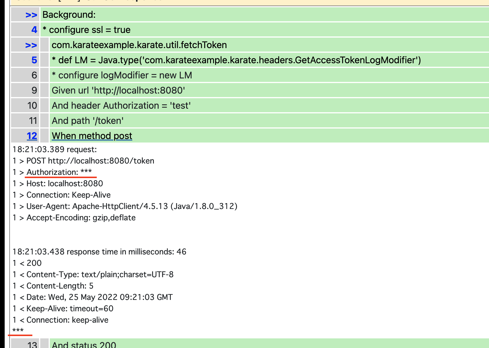
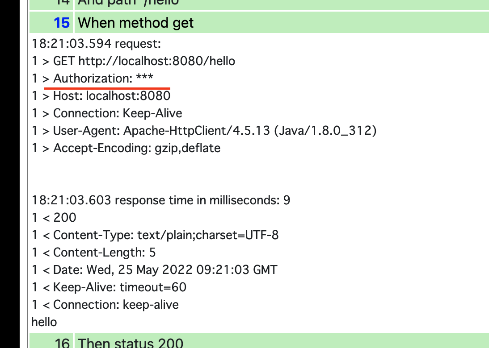
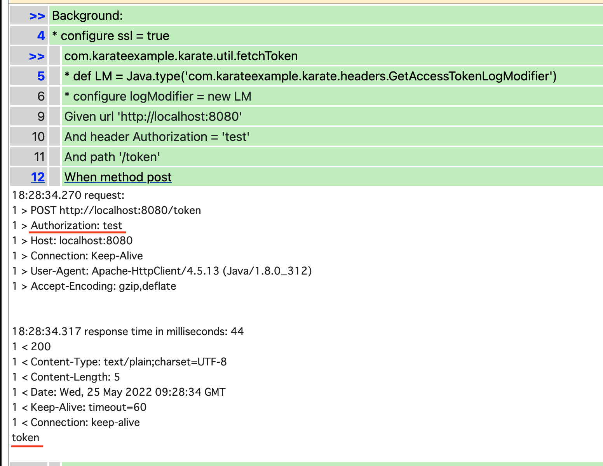
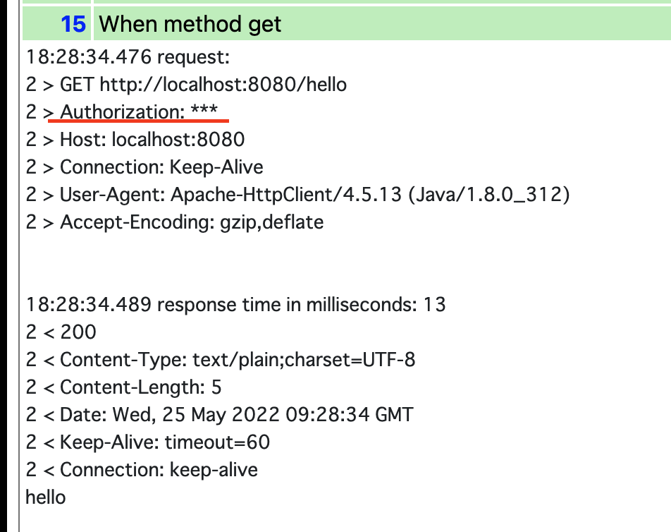

# What is this project?

This project was created to verify Karate's HttpLogModifier.

# Prerequisite

- Docker
- Java 8 (Not Necessary)

# How to start

First, start the API server with the following command.

```bash
% docker compose up
```

Verify that the API is working with the following command.

```bash
% curl "http://localhost:8080/hello"     
hello
```

```bash
% curl "http://localhost:8080/token" -X POST
token
```

Next, run the test.

```bash
% ./gradlew test       

BUILD SUCCESSFUL in 1s
5 actionable tasks: 5 up-to-date
```

A test report will be created under the `./build/karate-reports` directory.

Open the report.  
Verify that the header and response are masked when `/token` is accessed since `FetchAccessTokenLogModifier` is
implemented.  

And, verify that the `/hello` header are masked when accessing `/hello` since `LogModifier` is implemented.



# Problem

By upgrading the version of Karate JUnit 5 from 1.1.0 to 1.2.0, the header and response are not masked when
accessing `/token`.  
`testImplementation "com.intuit.karate:karate-junit5:1.2.0"`


On the other hand, the log when accessing `/hello` is properly masked.



# Causes and Solutions

I don't know the cause and solution yet, but I suspect that the problem is caused by the difference between `/token`
and `/hello`.  
The `/token` is called in `karate.callSingle()` in `karate-config.js`, while `/hello` is called in a scenario.

The differences between 1.1.0 and 1.2.0 shows that some changes have been made around logModifier.

Full Changelog: https://github.com/karatelabs/karate/compare/v1.1.0...v1.2.0

`karate-core/src/main/java/com/intuit/karate/http/HttpLogger.java`  
`karate-core/src/main/java/com/intuit/karate/core/Config.java`

I would be very grateful if someone could help me with this problem.
